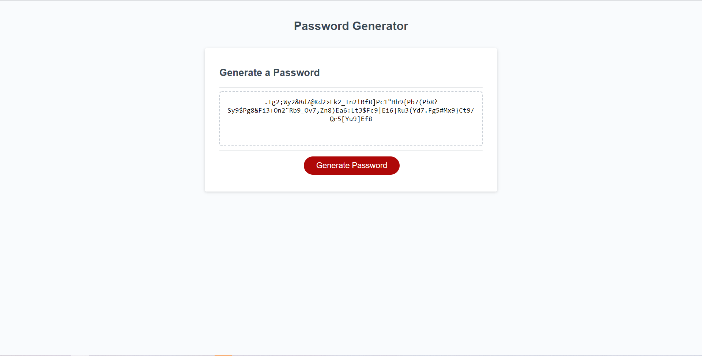

# password_generator

## Description
This is a password generator that will randomly create a secure password based on selected qualifications determined by the user. The user is asked to specify the length, whether to have numbers, uppercase, or special characters with lowercase as the base default. 

Length must be in between 8-128 characters, and the program will stop running if the user fails to meet that specification twice in a row. 

## Usage

Please click the link below to try my password generator
<https://sosoberg.github.io/password_generator/>